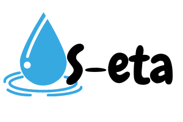

<h1 align="center">
    
     
    S-Eta
</h1>

<h4 align="center">
    SETA significa Simulador de Estação de tratamento de Água.
     
    Estou passando por problemas e preciso de sua ajuda para podemos levar água potável até os moradores da cidade de Caucaia.
</h4>

  <a href="#memo-license">License</a>

## :rocket: Technologies

- [ReactJS](https://reactjs.org/)
- [react-router-dom](https://github.com/ReactTraining/react-router)